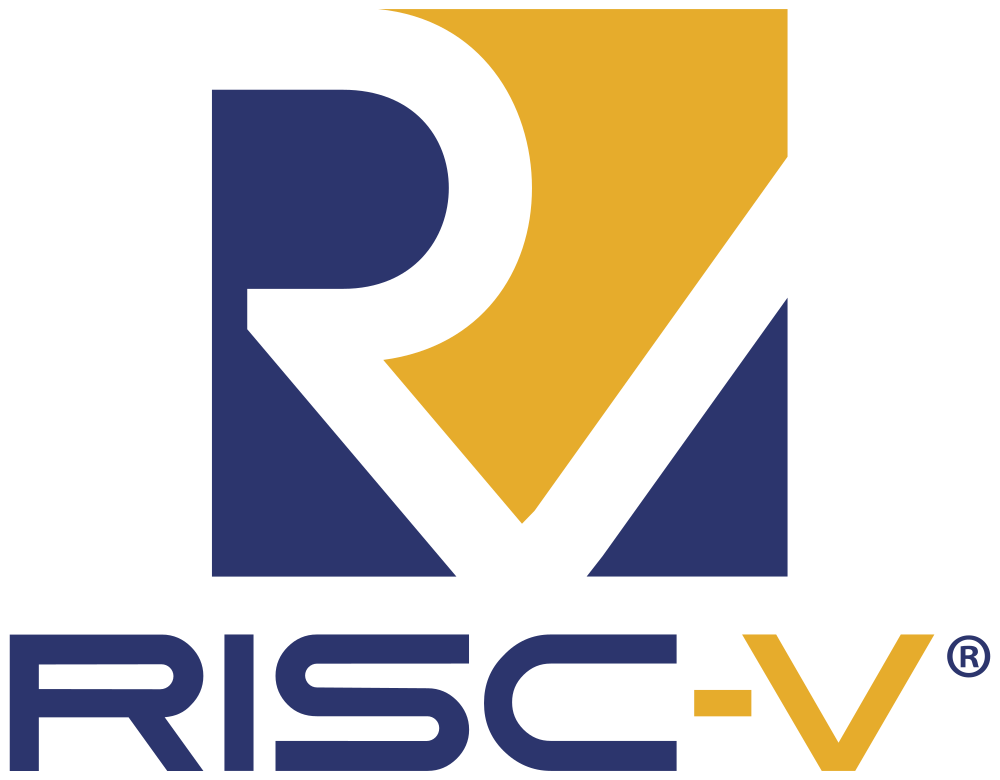

<!--
class: 
 - invert
 - lead
-->

## Building a RISC-V processor

---
<!-- class: invert -->
In this series we're going to build a RISC-V processor.

It won't be the most efficient processor, but it will work. 

---
<!-- class: invert -->
# Why?

I've always been interested in electronics, and I'm a proffessional software engineer. I've always wondered what happens where the rubber hits the road. When I write some code, what happens to the electrons and the transistors flowing around my CPU. This little journey is me trying to fill that gap in my understanding, and bringing you along the way!

---
RISC V - Step 1

We establish a trio of registers, and instruction decoder which can only decode one instruction, an ALU which can only add registers together, and a statemachine. We glue then together into an extremely bare bones single cycle processor.

Step 2

We add the `ADDI` instruction which adds an immediate value (i.e.  a constant) to a register and stores it.

Step 3

Using our ADD and ADDI instructions, we add the NOP and MV instructions as well as a partial implemtation of the LI instruction.

Step 4

We complete the first iteration of our ALU by adding the remaining arithmetic functions.
